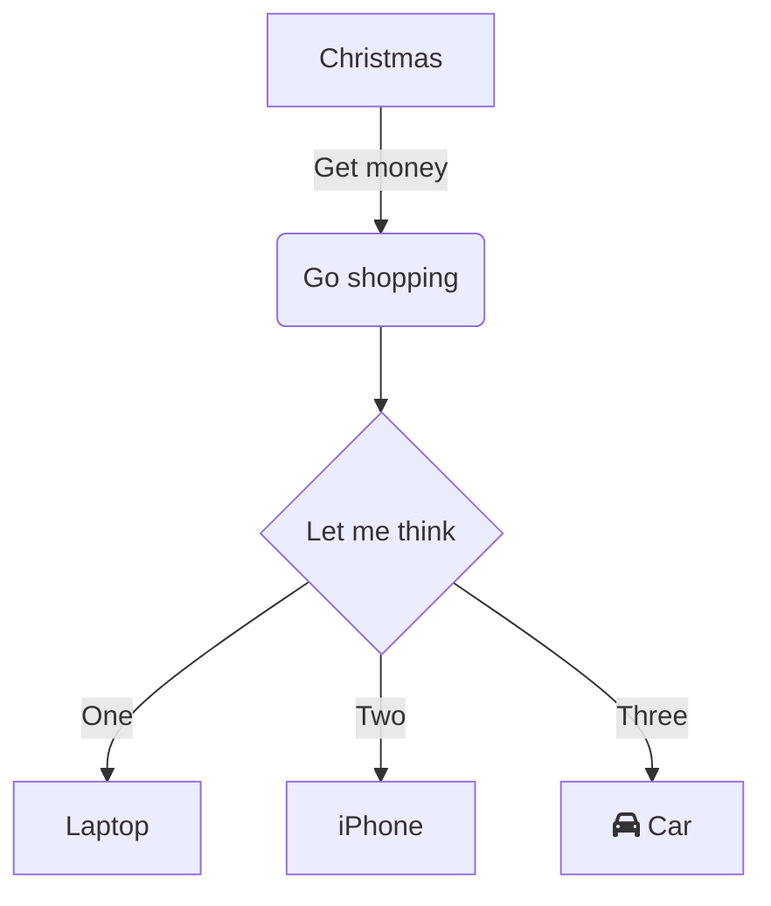
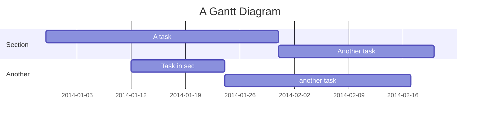
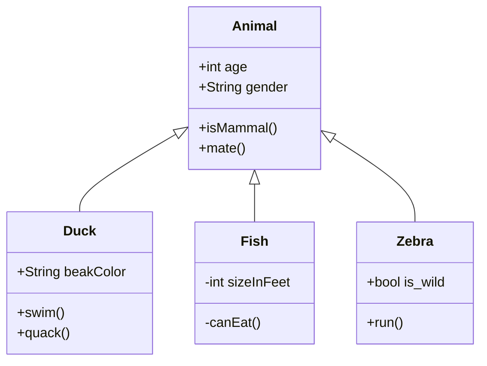
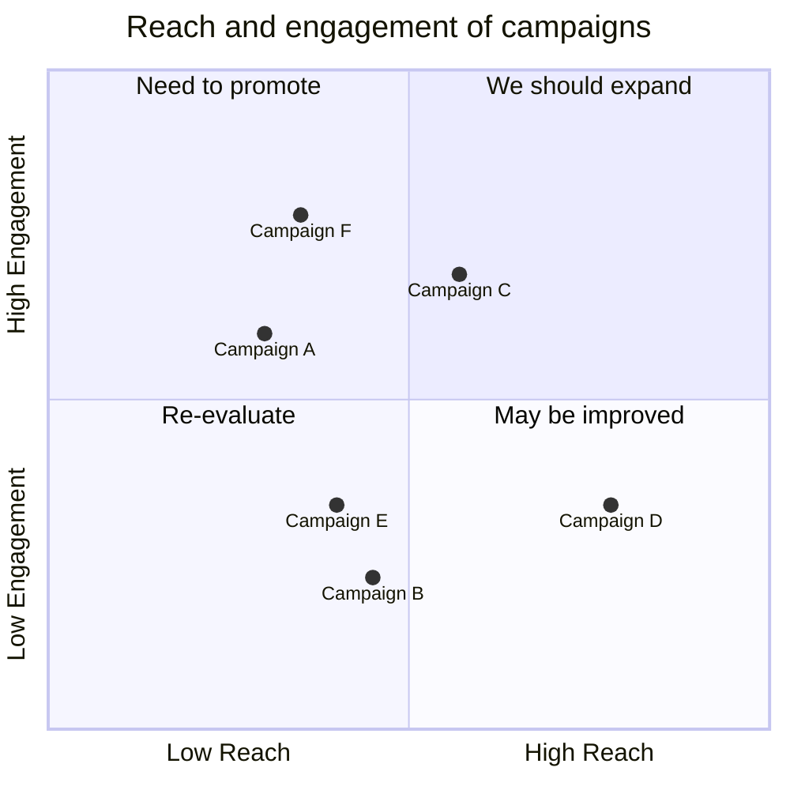

 // Start of Selection

## Video.js

该模板集成了 [Video.js](https://github.com/videojs/video.js)。您可以使用带有 `src` 和 `poster` 属性的简单 Vue 组件添加视频播放器。

```html
<video-player 
  src="https://files.testfile.org/Video%20MP4%2FLake%20-%20testfile.org.mp4" 
  poster="https://vitepress.dev/vitepress-logo-large.webp" 
/>
```

<video-player src="https://files.testfile.org/Video%20MP4%2FLake%20-%20testfile.org.mp4" poster="https://vitepress.dev/vitepress-logo-large.webp" />


## Image Viewer

该模板集成了 [Viewer.js](https://github.com/fengyuanchen/viewerjs)，无需额外设置，只需使用 Markdown 图片语法 ``。

尝试点击图片，然后放大/缩小。


## PostHog Analysis

PostHog 是一个出色的平台，涵盖了 [Google Analytics](https://developers.google.com/analytics)、[Microsoft Clarity](https://clarity.microsoft.com/) 以及更多的客户行为分析功能。

注册一个免费账户并更改 `config.mts` 文件，您将在几秒钟内看到读者的实时活动。


## Mermaid Examples

大多数 Mermaid 图表类型在此模板中均可使用，尝试在 [Mermaid Playground](https://mermaid.live/) 学习 Mermaid。









